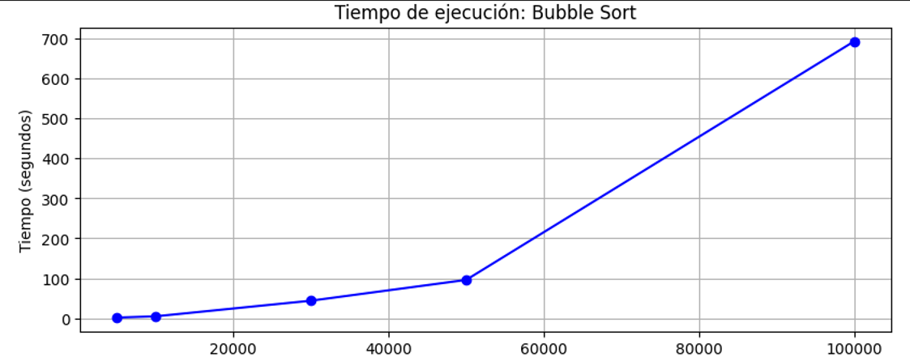
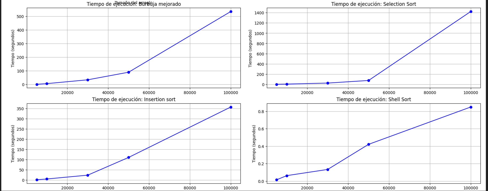
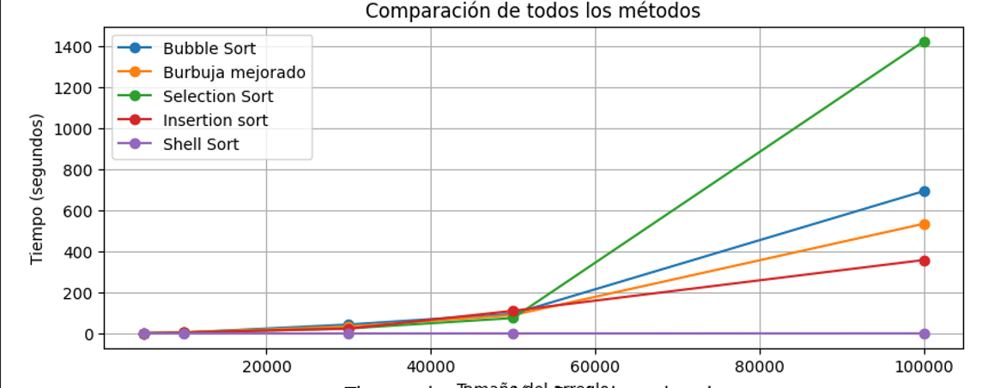

# Algoritmos de ordenamientos

## 📌 Información General

- **Título:** Algoritmos de Ordenamiento
- **Asignatura:** Estructura de Datos
- **Carrera:** Computación
- **Estudiante:** Cristopher Salinas, Juan JImenez
- **Fecha:** 11 / Mayo / 2025
- **Profesor:** Ing. Pablo Torres
  ---

## Descripcion del proyecto

En este proyecte realizaremos varias comparaciones sobre diferentes metodos ordenamientos con distintos tamaños de arreglos pra verificar cual es el mas optimo en situaciones de arreglos grandes o pequeños.
El proyecto fue realizado en python.
El codigo esta configurado para que cree un solo arreglo con la cantidad maxima que hay en las opciones, de esta forma para cada tamaño el arreglo toma una copia del arreglo mas grande que ya fue creado, con la cantidad que es especificada al llamar al metodo. EL metodo usa una misma semilla para los numeros random para evitar problemas.

Para ejecutar el proyecto:
1. Ejecuta el código:

    ```bash
    python app.py
    ```

## Capturas de pantalla

A continuación se presentan las capturas de pantalla de la ejecución en consola:





--- 

## Tabla de resultados

| Tamaño   | Bubble | Bubble Mejorado | Selección | Inserción | Shell |
|----------|--------|-----------------|-----------|-----------|-------|
| 5000     | 1.447  | 1.211           | 0.831     | 0.815     | 0.015 |
| 10000    | 4.701  | 6.048           | 4.864     | 4.745     | 0.062 |
| 30000    | 43.760 | 33.994          | 24.547    | 23.479    | 0.133 |
| 50000    | 95.808 | 89.624          | 75.267    | 110.483   | 0.420 |
| 100000   | 693.258| 534.441         | 1422.77   | 357.82    | 0.848 |

Resultado del tiempo demora en los diferentes arreglos

---

## Gráfica comparativa



---

##  Cocluciones con terminologia de notacion 

(Juan jimenez)

Los algoritmos Bubble Sort, Burbuja mejorado, Selection Sort e Insertion Sort presentan un crecimiento exponencial del tiempo conforme aumenta el tamaño del arreglo, lo que refleja su complejidad temporal cuadrática O(n²).

En contraste, Shell Sort mantiene un tiempo de ejecución consistentemente bajo, incluso con entradas de hasta 100,000 elementos, lo que demuestra un comportamiento mucho más eficiente, cercano a O(n log n) en promedio.

Bubble Sort toma más de 11 minutos (693 s) para ordenar 100,000 elementos, mientras que Shell Sort lo hace en menos de 1 segundo (0.85 s), lo que representa una diferencia de más de 800 veces en velocidad.

Insertion Sort supera incluso a Selection en ciertos casos pequeños, pero sufre mucho en tamaños grandes.
Burbuja mejorado es más rápido que Bubble clásico, especialmente con tamaños medianos (p. ej. en 30,000 elementos baja de 43.76 s a 33.99 s), pero sigue siendo impráctico para tamaños grandes.

Shell Sort es el único algoritmo probado que escala eficientemente. Su tiempo crece de 0.015 s (5,000) a solo 0.85 s (100,000), lo que sugiere que maneja grandes volúmenes con bajo costo computacional.

Para conjuntos de datos grandes, los algoritmos Shell Sort, Merge Sort o QuickSort deben ser preferidos sobre los métodos educativos como Bubble o Insertion, que solo son adecuados para fines didácticos o conjuntos muy pequeños.

(Cristopher Salinas)

Después de probar varios algoritmos de ordenamiento, se puede ver claramente que algunos funcionan mucho mejor que otros cuando el tamaño del arreglo crece. Algoritmos como Bubble Sort, Burbuja mejorado, Selection Sort e Insertion Sort tienen un tiempo de ejecución que aumenta muy rápido, porque su complejidad es cuadrática (O(n²)), lo que los hace poco prácticos para arreglos grandes.

Por ejemplo, Bubble Sort tarda más de 11 minutos en ordenar 100,000 elementos, mientras que Shell Sort hace lo mismo en menos de 1 segundo. Esa diferencia muestra lo importante que es elegir bien el algoritmo según el tamaño de los datos. Insertion Sort funciona mejor que Selection en arreglos pequeños, pero también se vuelve muy lento cuando los datos son muchos. Burbuja mejorado es un poco más rápido que Bubble clásico, pero aún así no es una buena opción para grandes volúmenes.

En cambio, Shell Sort demuestra ser mucho más eficiente. Sus tiempos de ejecución se mantienen bajos incluso con arreglos muy grandes, lo cual indica que escala mucho mejor. Por eso, para manejar grandes cantidades de datos, conviene usar algoritmos como Shell Sort, QuickSort o Merge Sort. Los métodos como Bubble o Insertion están bien para aprender, pero no son recomendables en situaciones reales con muchos datos.


## Repositorio del proyecto

[Algoritsmos de Ordenamientos](https://github.com/Juan-Jim/icc-est-u2-AlgoritmosOrdenmientos)
